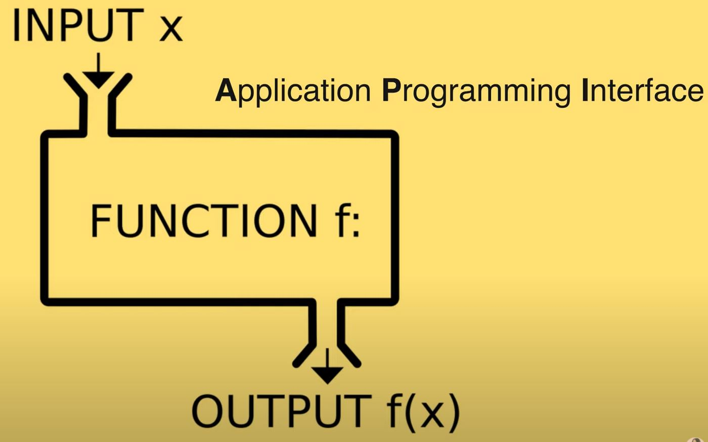

# * Functions



### -  function 선언
- fundamental building block in the progmram : 프로그램을 구성하는 기본적인 빌딩 블록
- sub-program 이라고 불리며 여러번 재사용이 가능하다 (can be use multiple times)
- 한가지의 테스크(performs a task) OR 어떠한 값을 계산(calculates a value) 하기 위해 사용한다

 1. Function declataion(JS에서의 함수 정리방법)
    : function name(param1, param2) { body... return;}
    - 한가지의 함수는 한가지의 일만 하도록 만들어야 한다(one function === one thing)
    - naming : doSomething, comman, verb
    - function is object in JS => 변수에 할당 할 수 있고 parm로 전달이 되고 함수를 리턴 할 수 있다

```JavaScript
function printHello(){ // 함수 정의
    console.log('Hello);
}

printHello(); // 함수 호출

```
=> 계속 Hello밖에 출력이 안돼서 쓸모가 없다

```JavaScript
function log(message){ // parameter(매개변수)로 message를 전달 하게 설정
    console.log(message); // message를 화면에 출력하도록 만든다
}
log('Hello'); // Hello가 출력된다
log(1234); // 1234가 출력된다
```
2. parameters 
    - premitive parameters : passed by value => 메모리에 value가 저장되어있기 때문에 value가 전달이 된다
    - object parameters : passed by reference => 메모리에 reference 가 저장되어 있어 reference가 전달된다

```JavaScript
function changeName(obj){ // changeName은 전달된 obj에 name을 무조건 coder로 변경하는 함수이다
    obj.name = 'coder';
}
const mingki = { name: 'mingki'}; // mingki라는 const를 정의 한 후 { name: 'mingki'} => mingki라는 obj를 만들어 할당 
changeName(mingki); // 전달된 obj.name 에서 mingki를 가리키고 있는 내용을 corder로 변경해준다
console.log(mingki); // corder 가  출력 된다
```
3. Default parameters 
```JavaScript
function showMessage(message, from){ // showMessage 는 (message, from) 이라는 2가지의 parameters를 받아오는 함수이다
    console.log('${message} by {from}'); // message 가 누구(from) 로 부터 왔는지 출력한다
}
showMessage('Hi!'); // message 만 입력하고 from을 입력하지 않아 " Hi! by undefined "가 출력된다

```
4. Rest parameters
```JavaScript
function printAll(...args){ /// ... 를 작성하게 되면 Rest parameters 라고 불리우며 배열 형태로  전달 된다
    for (let i = 0; i < args.length; i++){
        console.log(args[i]);
    }
}
printAll('dream', 'cording', 'ellie'); // printAll를 호출할 때 인자를 3개 전달 한다
```
5. Local scope => scope : 범위

```JavaScript
let globalMessage = 'global'; // global variable => 전체에서 사용가능
function printMessage(){
    let message = 'hello';
    console.log(message); // local variable => {} 안에서만 사용가능 
    // => hello 출력
    console.log(globalMessage);
    // => global 출력
   }
printMessage();
```
6. Return a value : 값을 return 한다

```JavaScript
function sum(a, b){
    return a + b;
}
const result = sum(1, 2); // 3 출력
console.log(`sum: ${sum(1,2)}`);
```

7. Early return, early exit
// bad
```JavaScript
function upgradeUser(user){
    if(user.poing > 10) {
        // long upgrade logic...
    }
}
```
//good
```JavaScript
function upgradeUser(user){
    if(user.poing > 10) { // 조건이 맞지 않을때 빨리 return을 해서 함수를 종료 시킨다
        return;
    }
     // long upgrade logic...
}
```

### -  function 사용

1. function expression : 함수가 선언 된 후 함수 사용이 가능하다 <-> function declaration : 선언 이 나중에 되어도 함수 사용이 가능하다(hoisted)

```JavaScript
const print = function(){ // 함수를 선언함과 동시에 변수 print에 할당한다 , 이름없는 함수 : anontmous function
    console.log('print');
}
print(); // print 출력
const printAgain = print; // 다른변수에 할당
printAgain(); // print 출력
const sumAgain = sum; 
console.log(sumAgain(1,3)); // 4 출력

```
2. Callback function using function expression : 상황에 맞는 함수를 호출하도록 전달하는것 

```JavaScript
function randomQuiz(answer, printYes, printNo){ // 정답과 맞을때 호출하게 될 함수, 틀릴때 호출하게 될 함수를 전달
    if(answer === 'love you'){
        printYes();
    } else {
        printNo();
    }
}
const printYes = function(){
    console.log('yes!);
};
const printNo = function(){
    console.log('no!);
};
randomQuiz('wrong', printYes, printNo); // no! 출력
randomQuiz('love you', printYes, printNo); // yes! 출력

```

** Arrow function : 항상 이름이 없는 함수다

```JavaScript
// 기본 코드
const simplePrint = function(){
    console.log('simplePrint!');
};

// Arrow function을 사용하면
const simplePrint = () => console.log('simplePrint!');

// 함수가 길어져 {} 을 사용할 경우 : return을 꼭 사용해야 한다
const simpleMultiply = (a,b) =>{
    // do someting more
    return a*b;
};
```

** IIFE : 함수를 선언 함과 동시에 바로 호출

```JavaScript
(function hello(){
    console.log('IIFE');
})(); 
```

** Quiz
```JavaScript
function calculate(){
    
}
