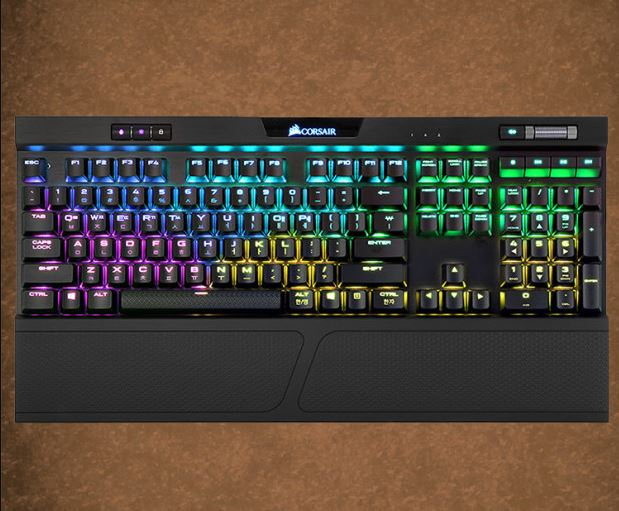

### Typing Master Game

★그림을 누르면 [링크](https://qkralswl689.github.io/typing-master/index.html)로 이동

유튜브채널 code Scalper님의 [Vanilla 자바스크립트 타자게임 만들기! 실전코스](https://www.youtube.com/watch?v=_CsGSE5gwTA&list=PLpJDjPqxGWGrSGPUBqWlsJlcLF_grNClK&index=1)을 클론코딩 하였다

화면에 나타나는 단어를 주어진 시간에 맞춰 정확하게 입력하면 1점 획득후 게임을 계속 이어나가고, 시간내 입력하지 못하면 게임이 종료된다 

개발 : [mingki](https://github.com/qkralswl689/typing-master)  
- 개발환경 : html,css, javascript, Visual Studio Code Editor  
- 작업시간 : 2시간

---
### 내가 배운 것
 ★
 ★
 ★ 