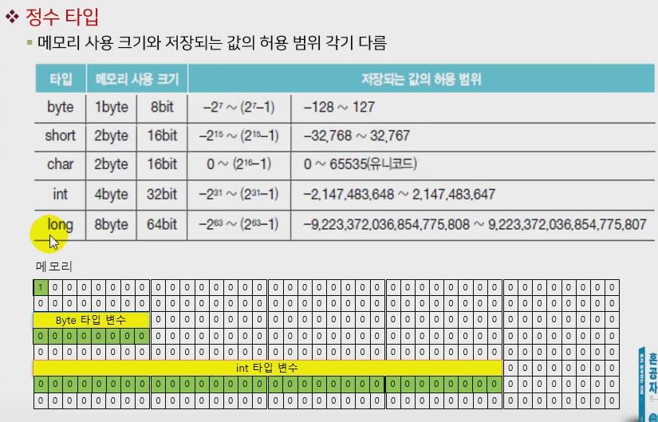
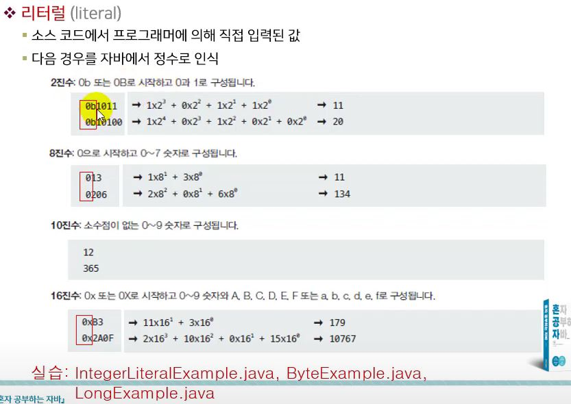
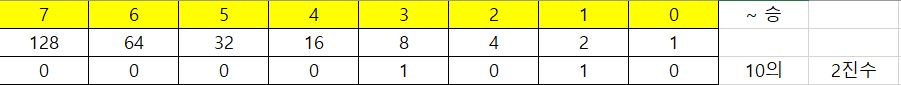
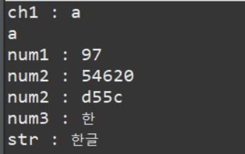
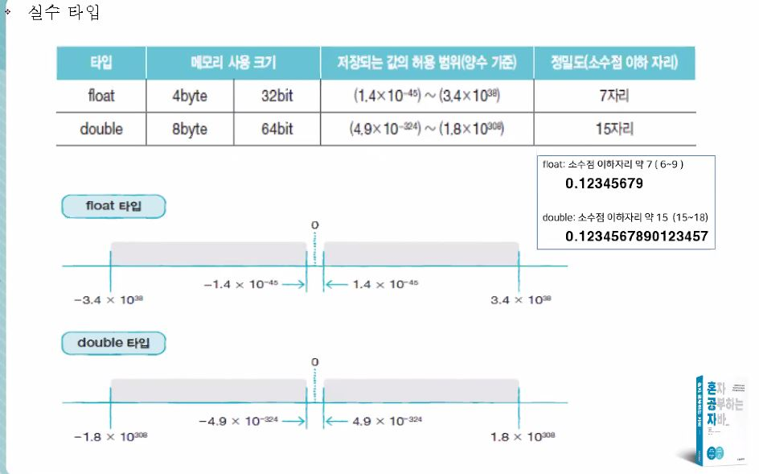
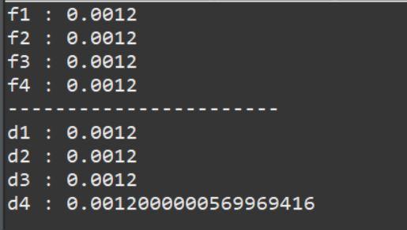
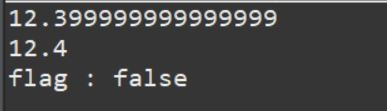

#### * 변수(variable)

```java
package com.javatem.jse;

public class JavaEx2 {
	
	String str; // 멤버 필드(변수) member field(variable) ①
    
	public static void main(String[] args) {
		
		String str; // 지역변수(local variablㅇe) str
		// 변수의 선언(declaration)		

 		str = "java"; // 변수의 초기화(initialization) : 처음 값이 할당(대입)
		str = "python"; // 변수 값의 할당(대입: assign)               

		String str2 = "html"; // 선언과 동시에 대입 => 변수의 초기화
		// 참고) javascript => var : 같은 변수를 재선언/할당
		// 참고) javasxript => const : 상수화 => 같은변수 재선언/재할당(대입) 불가
		// 참고) javasxript => let : 같은 변수를 재선언 불가
 
       		
	} 

} 
```
- 변수 (Variable) : 다양하게 변화를 줄 수 있는 것("vary" + "~able")
    - 값을 저장할 수 있는 메모리의 특정 번지에 붙여진 이름
    - ex) 건물  = 변수 ex) 대륭 3차...
    - ex) 건물의 종류 = 자료형  ex) 주상복합, 단독, 공동주택,...

##### ① String str; // 멤버 필드(변수) member field(variable)
- 별도 초기화 하지 않아도 기본 초기값 할당
- 클래스(참조 자료형) => 초기값 null 자동할당
##### ② String str; // 지역변수(local variable) str
- 변수의 선언(declaration)
- var str = "java'"; => since Java11 ex) javascript
- 참고) python : num = 1; => 자료형 무표기
- String : 자료형((data) type) => 참조형 자료형(reference data type)   
    - 참고) 기본 자료형(Java) : 소문자
    - 정수형: byte, short, int, long
	- 지역변수는 멤버 필드와 달리 초기값을 별도로 할당(대입:assign) 해야한다
    - 단, 배열 변수는 지역변수라도 초기값 자동 할당

##### 변수 타입
- 기본타입 (Prim titve Type)
    - 정수 타입 : byte, char, short, int, long
	: 메모리 사용크기와 저장되는 값의 허용 범위가 각기 다르다

	=> 메모리는 0과 1로 저장이 되는 저장소를 말한다
	   0과1이 저장되는 단위를 비트(bit)라고 말한다
	   bit가 8개가 모이면 1byte 라고 한다 => 4byte : 32개의 bit
	   * byte의 8개 bit 중에서 첫번째 칸 : +(양수) , -(음수) 를 구분한다 => 0 : 양수/ 1 : 음수
		 : 7개의 bit로 수의 크기를 결정해야 한다 7개의 0과 1을 10진수로 구분하기 위해서 2의 승으로 계산을 한다 : (2의 7승 -1) => 0이 포함되기 때문에 1을 빼준다
		 ** short, int, long 은 byte 수만 다르고 계산방식이 똑같다
	   * 예외 : char 타입 : 문자 코드를 저장하는데 쓰인다 -> 문자코드는 음수가 없다 => 0 ~ 65535 값을 가지게 된다
	- 실수 타입 : float, double
    - 논리 타입 : 불린형(불대수) => boolean
#### * 리터럴(literal)

- 문자형 : char
		-  하나의 문자를 저장할 수 있는 타입
		- 작은 따옴표로 감싼 문자리터럴은 유니코드로 변환되어 저장 => char타입은 정수타입
	```java
	char var1 = 'A'; // 유니코드 : 65
	char var2 = 'B'; // 유니코드 : 66
	char var3 = '가'; // 유니코드 : 44032
	```
	- char는 정수타입 이므로 10진수 OR 16진수 형태의 유니코드 저장가능
	```java
	char c = 65; // 10진수
	char c = 0x0041; // 16진수
	```

#### * 진법
```java
package com.javatem.jse;

public class JavaEx3 {

	public static void main(String[] args) {
		
		System.out.println("int의 범위 : " 
		+ Integer.MIN_VALUE + " ~ " + Integer.MAX_VALUE );
		// int의 최소값 ~ 최대값
		
		int num1 = 0x80000000; //16진수
		System.out.println("num1 : " + num1);
		// 10진수로 출력
		/* 4진수 : 표현하기에 너무 적어 빼버렸다
		   8진수 : 070
		   16진수 : 0X70
		   32진수 : 너무 복잡해서 빼버렸다 */
		
		String num2 = Integer.toBinaryString(num1);
		// 16진수를 2진수 문자열로 바꿔 출력
		System.out.println("num2 : " + num2);

		String num3 = Integer.toOctalString(num1);
		// 16진수를 8진수 문자열로 바꿔 출력
		System.out.println("num3 : " + num3);
		
		String num4 = Integer.toHexString(num1);
		// 16진수를 16진수 "문자열로" 바꿔 출력
		System.out.println("num4 : " + num4);
--------------------------------------------------------------------------------
        int num5 = 10;
		System.out.println("num5(5진수) : " + Integer.toBinaryString(num5));
		
		// int num6 = 0b1010; // B(b) = binary(2진수)
		int num6 = 0b1010; // 2진수
		System.out.println("num6(10진수) : " + num6);
		
		System.out.println("num7(8진수) : " + Integer.toOctalString(num5));
		int num7 = 012; // 8진수
		System.out.println("num7(10진수) : " + num7);
		
		System.out.println("num8(16진수) : " + Integer.toHexString(num5));
		int num8 = 0xa; // 16진수
		System.out.println("num8(16진수) : " + num8);

	}

}

```
* 출력 화면


* 진수 계산 출력 화면


#### * 정수타입 : char
```java
package com.javatem.jse;

public class JavaEx4 {

	public static void main(String[] args) {
		
		char ch1 = 'a'; // (O)'' 사용해야한다, "" 사용불가
		// char ch1 = "a".charAt(0); // 형변환(casting) (O)
		// char ch1 = "a"; // (X) '' 사용해야한다, "" 사용불가
		
		// 대입되는 값/상수(value, literal)
		System.out.println("ch1 : " + ch1);
		
		char ch2 =97; // 정수 -> 문자 자동 치환(형변환)
		// => ASCII 코드 
		System.out.println(ch2);
		
		int num1 = 'a'; // 문자 -> 정수 자동치환(형변환)
		int num2 = '한';
		System.out.println("num1 : " + num1);
		System.out.println("num2 : " + num2);
		System.out.println("num2 : " + Integer.toHexString(num2)); 
		// 16진수 : 0xd55c => 유니코드 : https://www.unicode.org/charts/PDF/UAC00.pdf
		char num3 = '\ud55c';
		System.out.println("num3 : " + num3);
		String str = "\ud55c\uae00"; // 유니코드(unicode) -> 문자 
		System.out.println("str : " + str);;

	}

}

```
* 출력 화면

- escape 문자 : 문자열 내부에 \ 는 escape문자를 뜻한다
    => 특정문자를 포함,출력 할 수 있다
#### * 실수 타입 (float, double)
- 실수 : 소숫점이 있는 수


```java
package com.javatem.jse;

public class JavaEx5 {

	public static void main(String[] args) {
		// 4byte 실수영(유리수형/부동소수형) : 대/소문자 구별 안한다
		float f1 = 0.12E-2F; // 0.12의 10의 -2승
		float f2 = 0.12E-2f; // 0.12의 10의 -2승
		float f3 = 0.12e-2f; // 0.12의 10의 -2승
		float f4 = 12e-4f; // 12의 10의 -4승
		
		System.out.println("f1 : " + f1);
		System.out.println("f2 : " + f2);
		System.out.println("f3 : " + f3);
		System.out.println("f4 : " + f4);
		System.out.println("-----------------------");
		double d1 = 0.12E-2;
		double d2 = 0.12E-2d;
		double d3 = 0.12E-2D;
		double d4 = 0.12E-2f; // float -> double 자동 치환(형변환)
		
		System.out.println("d1 : " + d1);
		System.out.println("d2 : " + d2);
		System.out.println("d3 : " + d3);
		System.out.println("d4 : " + d4); 
		// 1~3) 0.0012
		// 4,5) 0.0012000000569969416 (주의) 부동소수점 연산의 모순!

	}

}

```
* 출력 화면


* Java에서의 float, double 에서의 부동소수점 연산에서의 차이점
```java
package com.javatem.jse;

public class JavaEx6 {

	public static void main(String[] args) {
		double num1 = 1 + 5.6 + 5.8;
		float num2 = 1f + 5.6f + 5.8f;
		
		System.out.println(num1);
		System.out.println(num2);
		
		boolean flag = num1 == num2 ? true : false;
		System.out.println("flag : " + flag);

	}

}
```
* 출력 화면

